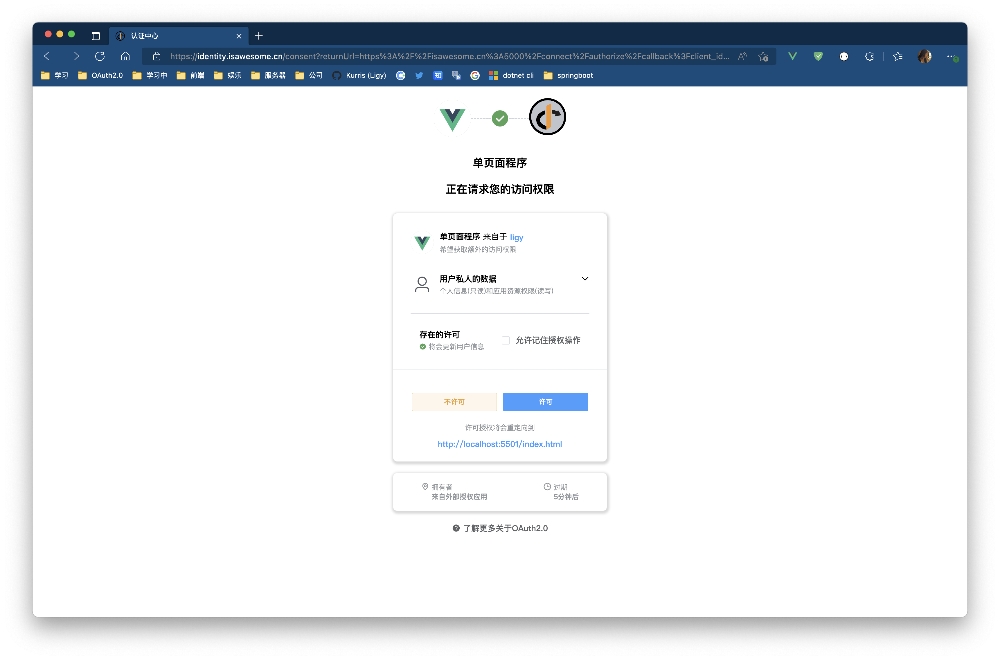

# IdentityServer.STS.Admin

>SPA implementation from [Skoruba.IdentityServer4.Admin](https://github.com/skoruba/IdentityServer4.Admin)
>includes Identityserver4 and Admin,thanks alot!


### 如何使用
[javascript demo from ids4](https://identityserver4.readthedocs.io/en/latest/quickstarts/4_javascript_client.html)
- 使用以下配置连接到[demo认证中心 (isawesome.cn)](https://identity.isawesome.cn/signIn)
```javascript
const config = {
      authority: 'https://isawesome.cn:5000',
      //authority: 'http://localhost:5000',
      client_id: 'spa',
      redirect_uri: 'http://localhost:5501/callback.html',
      post_logout_redirect_uri: 'http://localhost:5501/index.html',
      response_type: 'code',
      userStore: new Oidc.WebStorageStateStore({ store: window.localStorage }),
      scope: 'openid',
      // prompt: 'none'
    };
```

### 本地编译

- 克隆项目到本地

    ```shell
    git clone https://github.com/Kurris/IdentityServer.STS.Admin.git
    ```

- 检查配置文件 `cd ./IdentityServer.STS.Admin/src/appsetting.json`

    ```json
    //数据库配置
    "ConnectionStrings": {
        "ConfigurationDbConnection": "",
        "PersistedGrantDbConnection": "",
        "IdentityDbConnection": ""
      }
    ```

    ```json
    //前端项目启动地址
    "FrontendBaseUrl": "http://localhost:8080",
    ```

- 根据DbContext生成数据库,详见(ef core migration)

- 种子数据/数据脚本

    - [ ] 待完成

- 项目启动

    ```shell
    #IdentityServer.STS.Admin/src
    dotnet run  # http://localhost:5000
    
    #IdentityServer.STS.Admin/src/UI
    npm install
    npm run serve # http://localhost:8080
    ```
    
    浏览器启动: http://localhost:8080/signIn
    
### 已经实现的功能

- **用户信息管理(个人,client,授权)**

    
	
	
	
- **个人访问token**
	
	
- **双重验证**
	
	
- **外部登录(discord,微博,支付宝,github)**
	
	
- **同意屏幕**
	

## 待续完成

- [ ] Provide startup script and Admin account data
- [ ] Use vue3 rebuild UI
- [ ] Admin-dashboard
